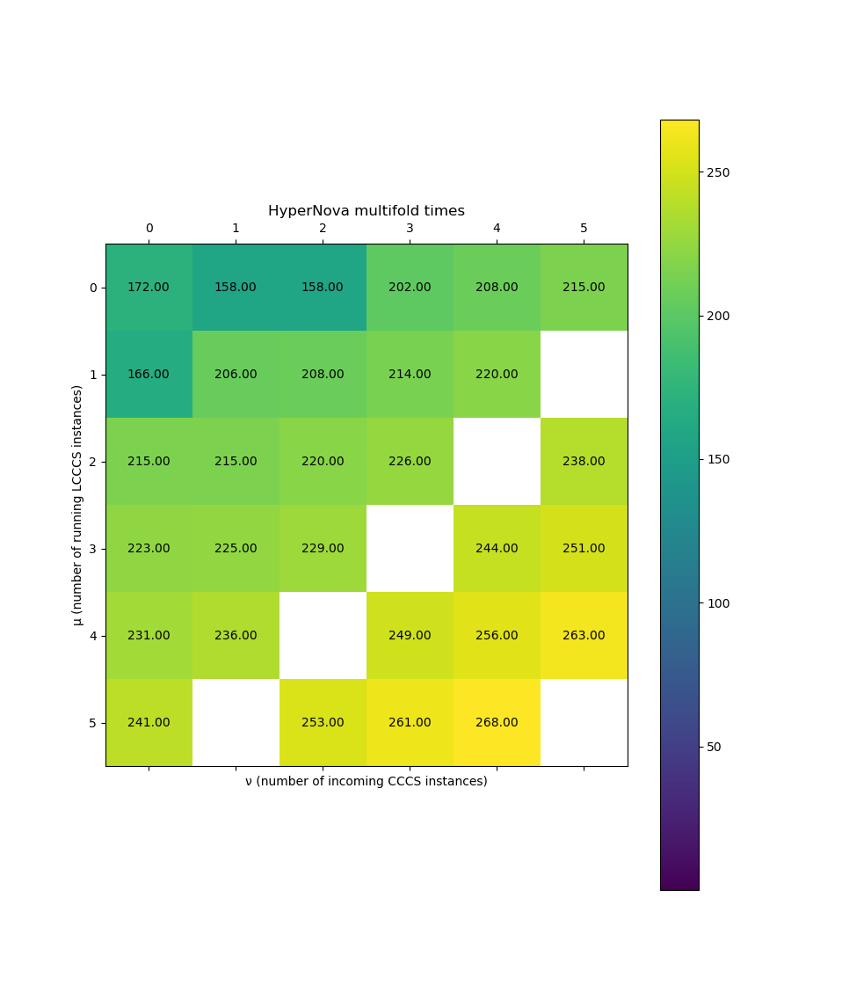

# sonobe-playground

## Current state

- ✅ Nova folding
- ✅ HyperNova without multifolding (μ = ν = 0)
- ✅ HyperNova multifolding (μ, ν ≥ 1)

## Reproduce

```bash
make prepare-circuit
make run
```

### Setting

- Use BN254-Grumpkin curves
- Use Circom-defined circuit with 256 step inputs and state width of 2. 
The circuit just copies old state to the new one.
- There are 360 steps in total (although, for multifolding there will be less)

### Machine used for benchmarks

AWS EC2 type `c6a.8xlarge` (32 vCPU, 64 GiB RAM)

### Benchmarked schemes:

- `Nova`
- `HyperNova<M, N>` with `M`, `N` from `{1, 2, 3, 4, 5, 6}`, excluding few configurations (those batching steps by either 7 or 11, which wouldn't cover all 360 inputs - technical detail)

### Results

```
Elapsed (wall clock) time (h:mm:ss or m:ss): 4:57:40
Maximum resident set size (kbytes): 2 072 392
```



```
Prepare input: 0.014000 seconds
Prepare circuit: 0.000064 seconds
Nova total time: 110.000000 seconds
HyperNova<1,1> total time: 428.000000 seconds
HyperNova<1,2> total time: 434.000000 seconds
HyperNova<1,3> total time: 496.000000 seconds
HyperNova<1,4> total time: 517.000000 seconds
HyperNova<1,5> total time: 537.000000 seconds
HyperNova<1,6> total time: 562.000000 seconds
HyperNova<2,1> total time: 499.000000 seconds
HyperNova<2,2> total time: 514.000000 seconds
HyperNova<2,3> total time: 535.000000 seconds
HyperNova<2,4> total time: 555.000000 seconds
HyperNova<2,5> total time: 579.000000 seconds
HyperNova<3,1> total time: 534.000000 seconds
HyperNova<3,2> total time: 551.000000 seconds
HyperNova<3,3> total time: 576.000000 seconds
HyperNova<3,4> total time: 594.000000 seconds
HyperNova<3,6> total time: 640.000000 seconds
HyperNova<4,1> total time: 567.000000 seconds
HyperNova<4,2> total time: 589.000000 seconds
HyperNova<4,3> total time: 609.000000 seconds
HyperNova<4,5> total time: 657.000000 seconds
HyperNova<4,6> total time: 681.000000 seconds
HyperNova<5,1> total time: 604.000000 seconds
HyperNova<5,2> total time: 627.000000 seconds
HyperNova<5,4> total time: 673.000000 seconds
HyperNova<5,5> total time: 696.000000 seconds
HyperNova<5,6> total time: 719.000000 seconds
HyperNova<6,1> total time: 643.000000 seconds
HyperNova<6,3> total time: 690.000000 seconds
HyperNova<6,4> total time: 710.000000 seconds
HyperNova<6,5> total time: 734.000000 seconds

--------------------------------------------------------------------------------
Scenario: Nova
  Prepare folding: 1.440000 seconds
  Transform input: 0.000000 seconds
  Folding verification: 0.019500 seconds
  Folding Steps:
    Input preparation
      Avg: 0.000139 seconds
      Min: 0.000001 seconds
      Max: 0.000294 seconds
    Proving
      Avg: 0.302000 seconds
      Min: 0.234000 seconds
      Max: 0.312000 seconds
--------------------------------------------------------------------------------
Scenario: HyperNova<1,1>
  Prepare folding: 2.950000 seconds
  Transform input: 0.000000 seconds
  Folding verification: 0.031900 seconds
  Folding Steps:
    Input preparation
      Avg: 0.000013 seconds
      Min: 0.000002 seconds
      Max: 0.000365 seconds
    Proving
      Avg: 1.179806 seconds
      Min: 1.070000 seconds
      Max: 1.200000 seconds
--------------------------------------------------------------------------------
Scenario: HyperNova<1,2>
  Prepare folding: 3.220000 seconds
  Transform input: 0.000000 seconds
  Folding verification: 0.032700 seconds
  Folding Steps:
    Input preparation
      Avg: 1.115444 seconds
      Min: 1.110000 seconds
      Max: 1.130000 seconds
    Proving
      Avg: 1.278167 seconds
      Min: 1.130000 seconds
      Max: 1.300000 seconds
--------------------------------------------------------------------------------
Scenario: HyperNova<1,3>
  Prepare folding: 3.690000 seconds
  Transform input: 0.000000 seconds
  Folding verification: 0.045900 seconds
  Folding Steps:
    Input preparation
      Avg: 2.554167 seconds
      Min: 2.540000 seconds
      Max: 2.590000 seconds
    Proving
      Avg: 1.546583 seconds
      Min: 1.290000 seconds
      Max: 1.570000 seconds
--------------------------------------------------------------------------------
Scenario: HyperNova<1,4>
  Prepare folding: 4.080000 seconds
  Transform input: 0.000000 seconds
  Folding verification: 0.044400 seconds
  Folding Steps:
    Input preparation
      Avg: 4.033000 seconds
      Min: 4.010000 seconds
      Max: 4.060000 seconds
    Proving
      Avg: 1.665222 seconds
      Min: 1.350000 seconds
      Max: 1.680000 seconds
--------------------------------------------------------------------------------
Scenario: HyperNova<1,5>
  Prepare folding: 4.350000 seconds
  Transform input: 0.000000 seconds
  Folding verification: 0.047000 seconds
  Folding Steps:
    Input preparation
      Avg: 5.621528 seconds
      Min: 5.600000 seconds
      Max: 5.650000 seconds
    Proving
      Avg: 1.777222 seconds
      Min: 1.400000 seconds
      Max: 1.800000 seconds
--------------------------------------------------------------------------------
Scenario: HyperNova<1,6>
  Prepare folding: 4.830000 seconds
  Transform input: 0.000000 seconds
  Folding verification: 0.051500 seconds
  Folding Steps:
    Input preparation
      Avg: 7.383000 seconds
      Min: 7.360000 seconds
      Max: 7.410000 seconds
    Proving
      Avg: 1.905667 seconds
      Min: 1.490000 seconds
      Max: 1.940000 seconds
--------------------------------------------------------------------------------
Scenario: HyperNova<2,1>
  Prepare folding: 3.480000 seconds
  Transform input: 0.000000 seconds
  Folding verification: 0.039800 seconds
  Folding Steps:
    Input preparation
      Avg: 1.270000 seconds
      Min: 1.260000 seconds
      Max: 1.290000 seconds
    Proving
      Avg: 1.480500 seconds
      Min: 1.260000 seconds
      Max: 1.490000 seconds
--------------------------------------------------------------------------------
Scenario: HyperNova<2,2>
  Prepare folding: 3.760000 seconds
  Transform input: 0.000000 seconds
  Folding verification: 0.041700 seconds
  Folding Steps:
    Input preparation
      Avg: 2.651750 seconds
      Min: 2.630000 seconds
      Max: 2.680000 seconds
    Proving
      Avg: 1.595167 seconds
      Min: 1.310000 seconds
      Max: 1.620000 seconds
--------------------------------------------------------------------------------
Scenario: HyperNova<2,3>
  Prepare folding: 4.180000 seconds
  Transform input: 0.000000 seconds
  Folding verification: 0.045100 seconds
  Folding Steps:
    Input preparation
      Avg: 4.177667 seconds
      Min: 4.150000 seconds
      Max: 4.220000 seconds
    Proving
      Avg: 1.719333 seconds
      Min: 1.400000 seconds
      Max: 1.740000 seconds
--------------------------------------------------------------------------------
Scenario: HyperNova<2,4>
  Prepare folding: 4.480000 seconds
  Transform input: 0.000000 seconds
  Folding verification: 0.046900 seconds
  Folding Steps:
    Input preparation
      Avg: 5.813194 seconds
      Min: 5.780000 seconds
      Max: 5.850000 seconds
    Proving
      Avg: 1.830694 seconds
      Min: 1.460000 seconds
      Max: 1.850000 seconds
--------------------------------------------------------------------------------
Scenario: HyperNova<2,5>
  Prepare folding: 4.950000 seconds
  Transform input: 0.000000 seconds
  Folding verification: 0.049800 seconds
  Folding Steps:
    Input preparation
      Avg: 7.599833 seconds
      Min: 7.560000 seconds
      Max: 7.650000 seconds
    Proving
      Avg: 1.960333 seconds
      Min: 1.530000 seconds
      Max: 2.000000 seconds
--------------------------------------------------------------------------------
Scenario: HyperNova<3,1>
  Prepare folding: 3.870000 seconds
  Transform input: 0.000000 seconds
  Folding verification: 0.043300 seconds
  Folding Steps:
    Input preparation
      Avg: 2.761000 seconds
      Min: 2.740000 seconds
      Max: 2.790000 seconds
    Proving
      Avg: 1.653917 seconds
      Min: 1.360000 seconds
      Max: 1.680000 seconds
--------------------------------------------------------------------------------
Scenario: HyperNova<3,2>
  Prepare folding: 4.270000 seconds
  Transform input: 0.000000 seconds
  Folding verification: 0.046000 seconds
  Folding Steps:
    Input preparation
      Avg: 4.308778 seconds
      Min: 4.280000 seconds
      Max: 4.360000 seconds
    Proving
      Avg: 1.769889 seconds
      Min: 1.420000 seconds
      Max: 1.810000 seconds
--------------------------------------------------------------------------------
Scenario: HyperNova<3,3>
  Prepare folding: 4.600000 seconds
  Transform input: 0.000000 seconds
  Folding verification: 0.048500 seconds
  Folding Steps:
    Input preparation
      Avg: 6.028472 seconds
      Min: 6.000000 seconds
      Max: 6.080000 seconds
    Proving
      Avg: 1.900278 seconds
      Min: 1.500000 seconds
      Max: 1.930000 seconds
--------------------------------------------------------------------------------
Scenario: HyperNova<3,4>
  Prepare folding: 5.050000 seconds
  Transform input: 0.000000 seconds
  Folding verification: 0.049700 seconds
  Folding Steps:
    Input preparation
      Avg: 7.806833 seconds
      Min: 7.760000 seconds
      Max: 7.850000 seconds
    Proving
      Avg: 2.010500 seconds
      Min: 1.560000 seconds
      Max: 2.050000 seconds
--------------------------------------------------------------------------------
Scenario: HyperNova<3,6>
  Prepare folding: 5.890000 seconds
  Transform input: 0.000000 seconds
  Folding verification: 0.055100 seconds
  Folding Steps:
    Input preparation
      Avg: 11.815556 seconds
      Min: 11.800000 seconds
      Max: 11.900000 seconds
    Proving
      Avg: 2.272444 seconds
      Min: 1.680000 seconds
      Max: 2.310000 seconds
--------------------------------------------------------------------------------
Scenario: HyperNova<4,1>
  Prepare folding: 4.390000 seconds
  Transform input: 0.000000 seconds
  Folding verification: 0.047000 seconds
  Folding Steps:
    Input preparation
      Avg: 4.431778 seconds
      Min: 4.400000 seconds
      Max: 4.460000 seconds
    Proving
      Avg: 1.813444 seconds
      Min: 1.450000 seconds
      Max: 1.840000 seconds
--------------------------------------------------------------------------------
Scenario: HyperNova<4,2>
  Prepare folding: 4.680000 seconds
  Transform input: 0.000000 seconds
  Folding verification: 0.049800 seconds
  Folding Steps:
    Input preparation
      Avg: 6.173333 seconds
      Min: 6.130000 seconds
      Max: 6.220000 seconds
    Proving
      Avg: 1.937778 seconds
      Min: 1.540000 seconds
      Max: 1.960000 seconds
--------------------------------------------------------------------------------
Scenario: HyperNova<4,3>
  Prepare folding: 5.130000 seconds
  Transform input: 0.000000 seconds
  Folding verification: 0.052500 seconds
  Folding Steps:
    Input preparation
      Avg: 8.005333 seconds
      Min: 7.970000 seconds
      Max: 8.040000 seconds
    Proving
      Avg: 2.053833 seconds
      Min: 1.590000 seconds
      Max: 2.090000 seconds
--------------------------------------------------------------------------------
Scenario: HyperNova<4,5>
  Prepare folding: 6.010000 seconds
  Transform input: 0.000000 seconds
  Folding verification: 0.056800 seconds
  Folding Steps:
    Input preparation
      Avg: 12.133333 seconds
      Min: 12.100000 seconds
      Max: 12.200000 seconds
    Proving
      Avg: 2.320222 seconds
      Min: 1.720000 seconds
      Max: 2.370000 seconds
--------------------------------------------------------------------------------
Scenario: HyperNova<4,6>
  Prepare folding: 6.320000 seconds
  Transform input: 0.000000 seconds
  Folding verification: 0.057600 seconds
  Folding Steps:
    Input preparation
      Avg: 14.390000 seconds
      Min: 14.300000 seconds
      Max: 14.500000 seconds
    Proving
      Avg: 2.462750 seconds
      Min: 1.810000 seconds
      Max: 2.510000 seconds
--------------------------------------------------------------------------------
Scenario: HyperNova<5,1>
  Prepare folding: 4.930000 seconds
  Transform input: 0.000000 seconds
  Folding verification: 0.049600 seconds
  Folding Steps:
    Input preparation
      Avg: 6.337500 seconds
      Min: 6.300000 seconds
      Max: 6.380000 seconds
    Proving
      Avg: 1.988333 seconds
      Min: 1.560000 seconds
      Max: 2.010000 seconds
--------------------------------------------------------------------------------
Scenario: HyperNova<5,2>
  Prepare folding: 5.270000 seconds
  Transform input: 0.000000 seconds
  Folding verification: 0.051400 seconds
  Folding Steps:
    Input preparation
      Avg: 8.257000 seconds
      Min: 8.210000 seconds
      Max: 8.320000 seconds
    Proving
      Avg: 2.111000 seconds
      Min: 1.630000 seconds
      Max: 2.140000 seconds
--------------------------------------------------------------------------------
Scenario: HyperNova<5,4>
  Prepare folding: 6.110000 seconds
  Transform input: 0.000000 seconds
  Folding verification: 0.059200 seconds
  Folding Steps:
    Input preparation
      Avg: 12.437778 seconds
      Min: 12.400000 seconds
      Max: 12.500000 seconds
    Proving
      Avg: 2.382667 seconds
      Min: 1.770000 seconds
      Max: 2.430000 seconds
--------------------------------------------------------------------------------
Scenario: HyperNova<5,5>
  Prepare folding: 6.440000 seconds
  Transform input: 0.000000 seconds
  Folding verification: 0.058500 seconds
  Folding Steps:
    Input preparation
      Avg: 14.712500 seconds
      Min: 14.700000 seconds
      Max: 14.800000 seconds
    Proving
      Avg: 2.513000 seconds
      Min: 1.830000 seconds
      Max: 2.550000 seconds
--------------------------------------------------------------------------------
Scenario: HyperNova<5,6>
  Prepare folding: 6.750000 seconds
  Transform input: 0.000000 seconds
  Folding verification: 0.062700 seconds
  Folding Steps:
    Input preparation
      Avg: 17.125000 seconds
      Min: 17.100000 seconds
      Max: 17.200000 seconds
    Proving
      Avg: 2.643889 seconds
      Min: 1.900000 seconds
      Max: 2.690000 seconds
--------------------------------------------------------------------------------
Scenario: HyperNova<6,1>
  Prepare folding: 5.360000 seconds
  Transform input: 0.000000 seconds
  Folding verification: 0.051300 seconds
  Folding Steps:
    Input preparation
      Avg: 8.461167 seconds
      Min: 8.420000 seconds
      Max: 8.500000 seconds
    Proving
      Avg: 2.161333 seconds
      Min: 1.680000 seconds
      Max: 2.190000 seconds
--------------------------------------------------------------------------------
Scenario: HyperNova<6,3>
  Prepare folding: 6.250000 seconds
  Transform input: 0.000000 seconds
  Folding verification: 0.057400 seconds
  Folding Steps:
    Input preparation
      Avg: 12.748889 seconds
      Min: 12.700000 seconds
      Max: 12.800000 seconds
    Proving
      Avg: 2.433111 seconds
      Min: 1.820000 seconds
      Max: 2.470000 seconds
--------------------------------------------------------------------------------
Scenario: HyperNova<6,4>
  Prepare folding: 6.530000 seconds
  Transform input: 0.000000 seconds
  Folding verification: 0.058700 seconds
  Folding Steps:
    Input preparation
      Avg: 15.055000 seconds
      Min: 15.000000 seconds
      Max: 15.100000 seconds
    Proving
      Avg: 2.555500 seconds
      Min: 1.880000 seconds
      Max: 2.590000 seconds
--------------------------------------------------------------------------------
Scenario: HyperNova<6,5>
  Prepare folding: 6.890000 seconds
  Transform input: 0.000000 seconds
  Folding verification: 0.060100 seconds
  Folding Steps:
    Input preparation
      Avg: 17.511111 seconds
      Min: 17.400000 seconds
      Max: 17.600000 seconds
    Proving
      Avg: 2.689167 seconds
      Min: 1.940000 seconds
      Max: 2.730000 seconds
```
